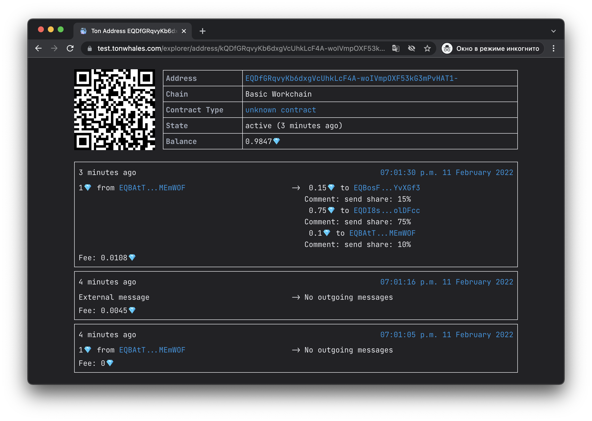

## ton-share-smc

[](https://ton.org/docs/#/func)
[](https://newton-blockchain.github.io/docs/fiftbase.pdf)
[](https://ton.org/)

TON based smart contract, which allows incoming transactions
to be divided into many parts. For example, it can be useful, 
when you want to share profits with your partners. During 
initialization the share in percent of each partner is set.

### Setup guide

#### Build FunC code

```bash
func -SPA -o auto/share-code.fif lib/stdlib.fc share.fc
```

#### Create holders list

Create a file with the addresses of the shareholders(not more than 100). 
The share is an integer number. The total share of all holders must be 100.

Example file(`holders.txt`):

```txt
+HOLDER EQBAtTjqPOsBvWPO_ij7xkLA11cjiXUKA3gRHVSbrYMEmWOF 75
+HOLDER EQDI8skSrGW5EJX6UaU9WP8WY_VaM8cg7gDYFNWsn6olDFcc 14.3
+HOLDER EQBosFYEWK-JOuNOdsN-iUoTaKwS4G0hoNTUrhfndZYvXGf3 10.7
```

#### Create initialization external message

```bash
fift -s init.fif holders.txt 0
```

For more information execute `fift -s init.fif`, it 
will be print the help message of script.

After a successful message generation you will be able to see 
the address of the smart contract. Send some TONs to it
(0.1 will be enough). After that you can send the boc file to the network.

#### Deploy smart-contract

This requires a specific network configuration file.  
You can use popular configuration files:

- [global.config.json](https://newton-blockchain.github.io/global.config.json)
- [testnet-global.config.json](https://newton-blockchain.github.io/testnet-global.config.json)

Now send the BOC file using the `lite-client`:

```bash
lite-client -C testnet-global.config.json -c "sendfile auto/init.boc"
```

### How to use

It's very simple! Send any amount of TON to a smart contract 
(another smart contract can also do this) and it will 
automatically distribute it to the shareholders.



The smart contract also has the `get_holders` get-method, which 
can be used to get  a list of shareholders. You can call 
it with `get_holders.py`for example. For more
information, run `get_holders.py --help`.

### Usefully information

You can find the source code for the FunC, Fift, 
and lite-client builds in this [repository](https://github.com/ton-blockchain/ton).

#### LICENSE

All source code, except some files in the `lib` directory, is distributed under the the `GPL-3.0 License`. The licenses of the libraries that are in the `lib` folder are listed at the head of the library files.